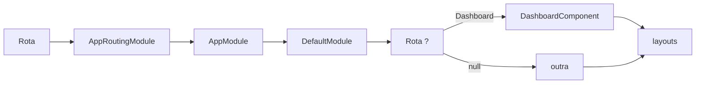
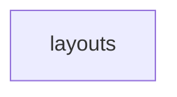

# Layout

> Diagrama

```mermaid
graph LR;
Rota-->AppRoutingModule-->AppModule-->
DefaultModule-->B[Rota ?];
B-- Dashboard -->C[DashboardComponent]-->layouts;
B-- null -->D["outra"]-->layouts;
```
---
 

```mermaid
graph LR;
layouts


```
---
 

